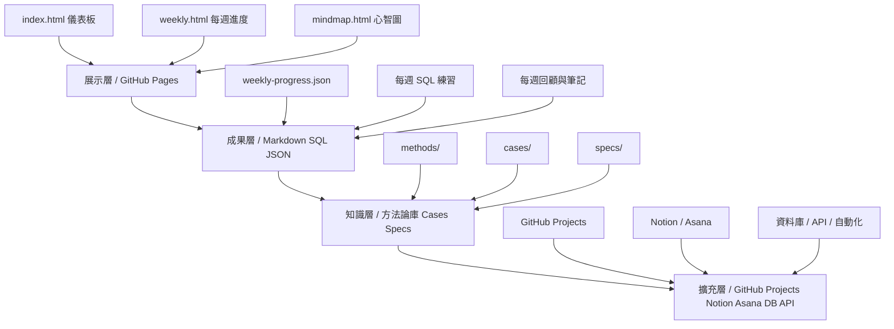

# SA Learning Hub 架構示意

## 核心原則
- 心智圖決定知識分類
- HTML 決定介面與操作方式
- GitHub 負責保存、版本控管、發佈

## 分層說明
### 1. 展示層
用來看首頁、週進度、心智圖、成果入口。

### 2. 成果層
保存 SQL、Markdown、JSON、圖片、規格草稿。

### 3. 知識層
把案例萃取成方法，把方法再沉澱成可重用資產。

### 4. 擴充層
未來可串接 GitHub Projects、Notion、Asana、外部資料源與資料庫。
