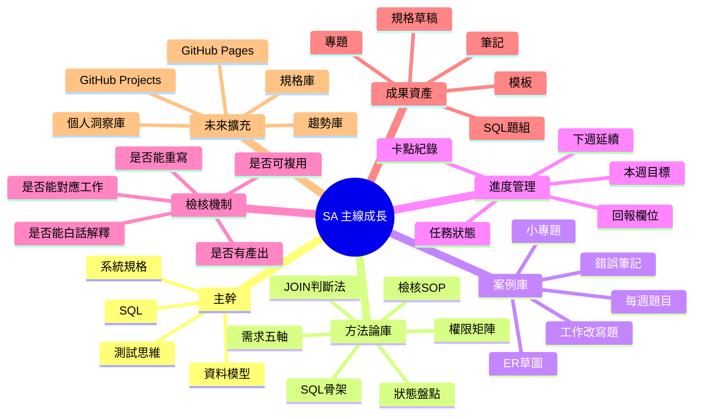

# SA 主線心智圖

```mermaid
mindmap
  root((SA 主線成長))
    主幹
      SQL
      資料模型
      系統規格
      測試思維
    方法論庫
      SQL骨架
      JOIN判斷法
      需求五軸
      狀態盤點
      權限矩陣
      檢核SOP
    案例庫
      每週題目
      工作改寫題
      ER草圖
      錯誤筆記
      小專題
    進度管理
      本週目標
      任務狀態
      回報欄位
      卡點紀錄
      下週延續
    檢核機制
      是否能白話解釋
      是否能重寫
      是否能對應工作
      是否有產出
      是否可複用
    成果資產
      筆記
      SQL題組
      模板
      規格草稿
      專題
    未來擴充
      規格庫
      趨勢庫
      個人洞察庫
      GitHub Pages
      GitHub Projects
```
